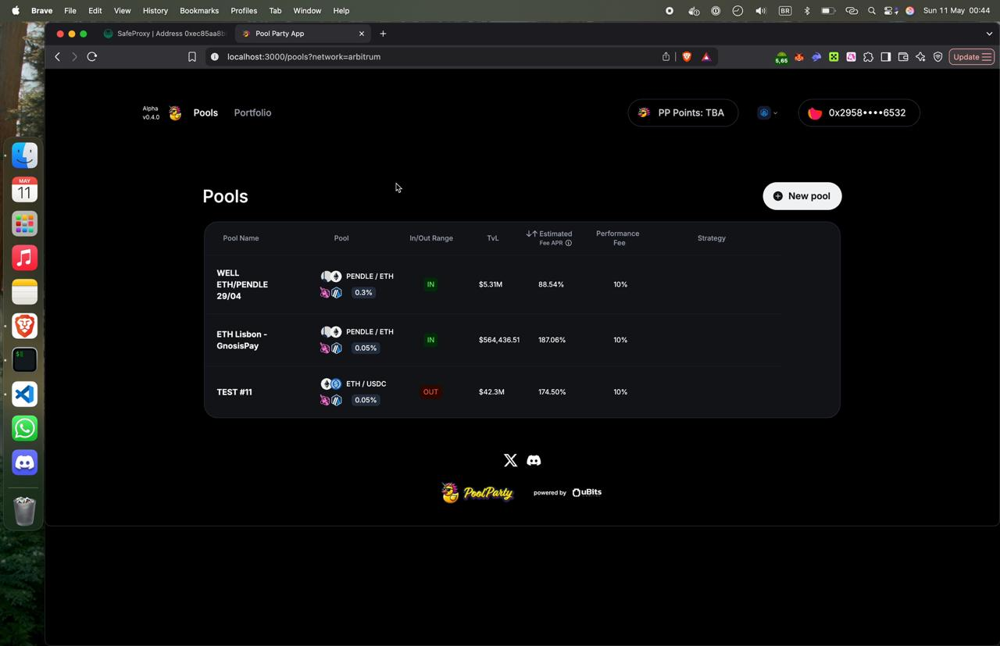
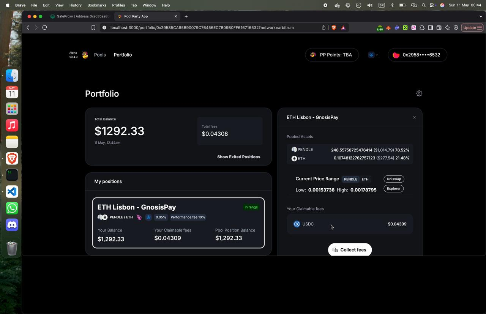
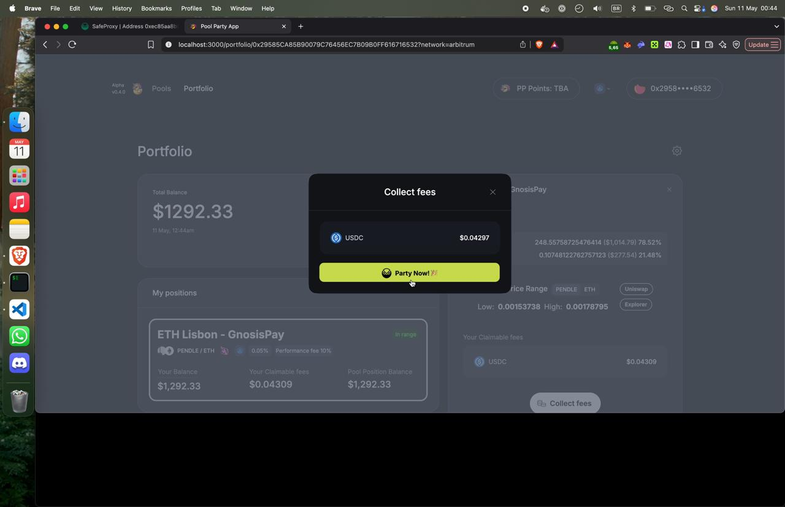
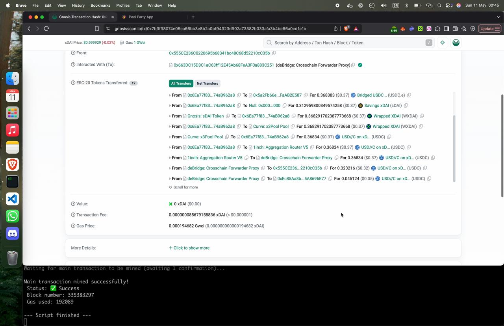

## Summary

We have simplified fee collection from PoolParty protocol LPs with a seamless Gnosis Pay top-up button using deBridge API, making DeFi more meaningful and useful for protocol users. The system manages USDC fee withdrawal from the protocol, off-chain approval, transfer to wallet, bridging funds from Arbitrum to Gnosis Chain USDC, waiting for the bridge to execute, and transferring to the user’s Gnosis Safe address.

## Motivation

In a world where DeFi is technically complex and becoming more automated, trust will become the gateway to action.

We humans do not just seek information, we seek reassurance. When money is involved, people look for someone they already trust: friends, familiar voices, and peers who’ve walked the path before.

*At Pool Party we turn personal trust into a social liquidity primitive for DeFi.*

Our platform opens Uniswap strategies others can join with USDC, account abstraction, and full self-custody. It’s not copy trading — it is co-investing, securely and 100% on-chain. Pool managers become DeFi-nancial advisors, earning performance fees from their most valuable social asset: trust.

Since we started playing with PoolParty LPs, we dreamed of paying for groceries, dinner, or parties without having to go through centralized exchanges.

Now we can.

### Presenting the PARTY NOW button

We’ve implemented a Gnosis Pay card top-up button on the Pool Party front end. Now, we can collect LP fees straight to the card and start the party right away.

The PARTY NOW button abstracts the entire flow in one place.

Behind the scenes:

•⁠  ⁠Collect USDC fees  
•⁠  ⁠Off-chain approval  
•⁠  ⁠Transfer to wallet  
•⁠  ⁠Bridge via deBridge (Arbitrum → Gnosis)  
•⁠  ⁠Execute the bridge  
•⁠  ⁠Top-up the Gnosis Pay card

## Links

•⁠  ⁠[DEMO VIDEO](https://youtu.be/GMlMwGc-vNE)  
•⁠  ⁠[Pool location](https://alpha.pool-party.xyz/pools)  
•⁠  ⁠[Gnosis Safe Wallet](https://gnosisscan.io/address/0xEc85Aa8b0aEE121C41034Ce287284715A8696E77)

## Future Developments

Later, we can use this framework to collect fees from all chains or even automate at a defined threshold.

## Final thoughts

Pool Party solves two of the biggest psychological gaps between infrastructure and usability in DeFi: *trust* and *everyday value*.  
Making DeFi more accessible, social, and useful for all — while being 100% self-custodial.

*Let’s party!*
